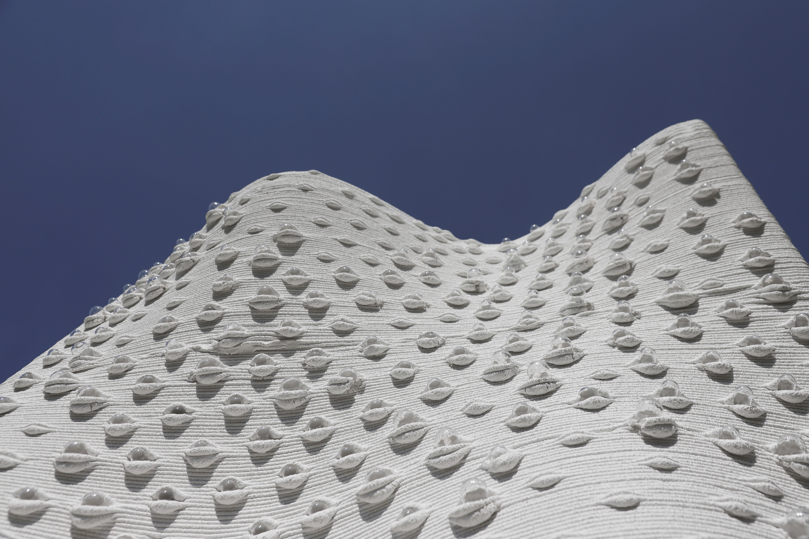
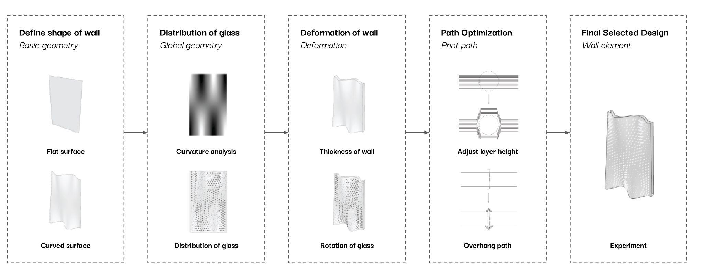
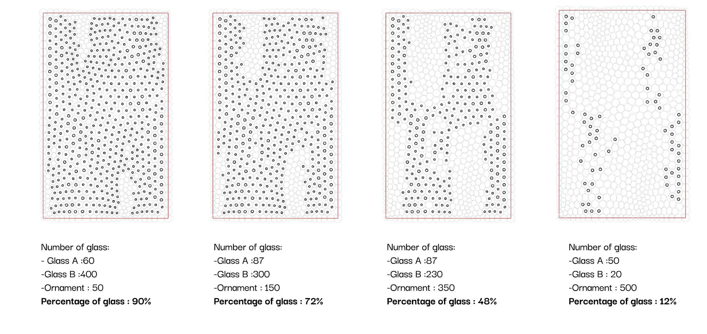
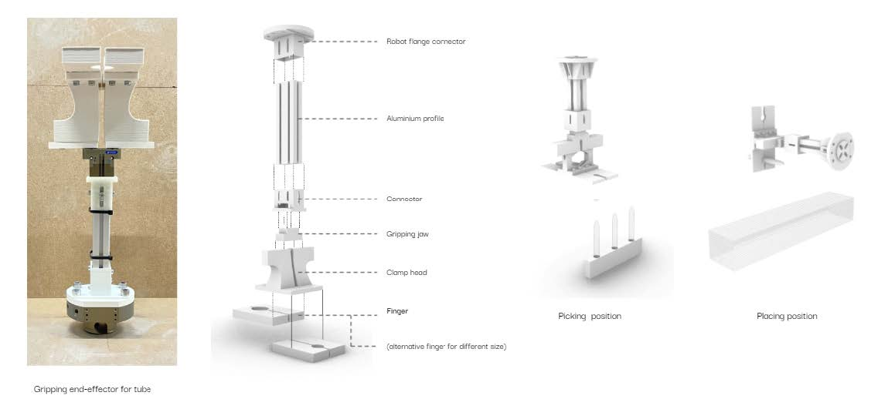
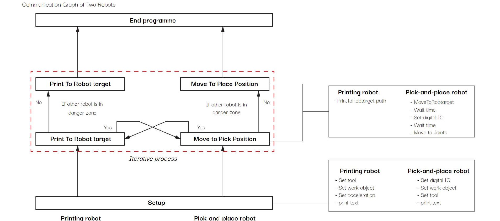

---

title: 'Imprint Concrete'
description: " "
date: 2021-09-15T02:56:14+02:00
draft: fasle
tags: ["robotics", "software", "automation", "computational design", "3d printing"]

---


A study on glass inlays for Robotic 3D Concrete Printing and Placing


## Abstract

The method explored is by combining robotic 3D concrete printing and robotic glass placing into one system which can further rapid automation for the field. The research would focus on bridging the communication between both the robots and to design an end-effecor for this system. To illustrate this process the research concludes with a 1:1 scale transparent concrete wall that allows us to reflect and evaluate the complete study.

## Design Methodology

The computational tool is further classified by defining the shape of the wall, deciding distribution percentage, deforming the wall, path optimization and the final design is then sent for fabrication. This developed tool will further help develop the complete workflow, design logic and application for the fabrication.

 

## Robotic Fabrication

The two fabrication processes are 3D Concrete printing and robotic Pick-and-Place. For 3D Concrete printing, using the ABB IRB 6700 with concrete extrusion end-effecter. And the robotic Pick-and-Place method is using ABB IRB 4600 on overhead gantry and the primary tasks will be developing the hands-on end-effector gripper with the robotic fabrication setup. In addition, multi-robot systems will aim to be developed with two main task: development of end-effector gripper, and Coordination of two different robotic fabrication systems.

### end-effector gripper

### Path algorithm for multi-robot system

<video width="1920" height="1080" controls>
  <source src="./Fabricaiton_video.mp4" type="video/mp4">
</video>

## Application

---

#### Publications
* [CAADRIA](https://papers.cumincad.org/cgi-bin/works/paper/caadria2023_365)
* [ETH DFAB](https://www.masdfab.com/2019-20-t3-mas-dfab)
* [theCharette](https://thecharette.org/aty-2021-results/)
