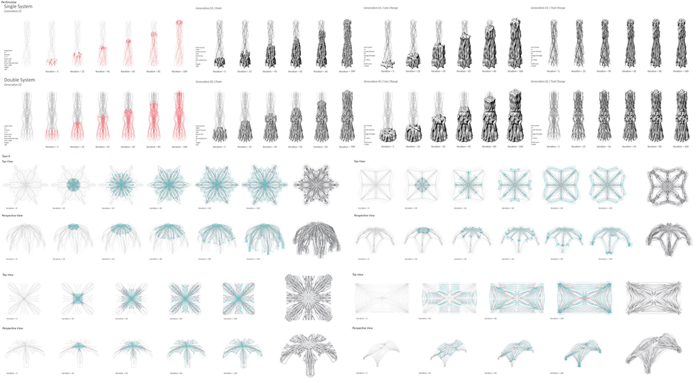
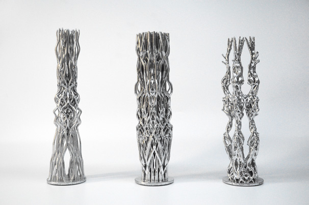
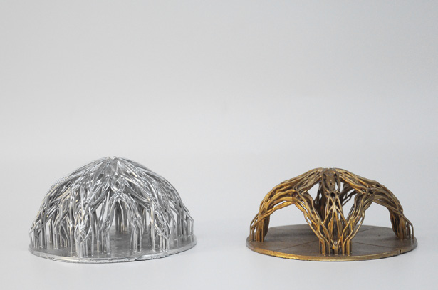
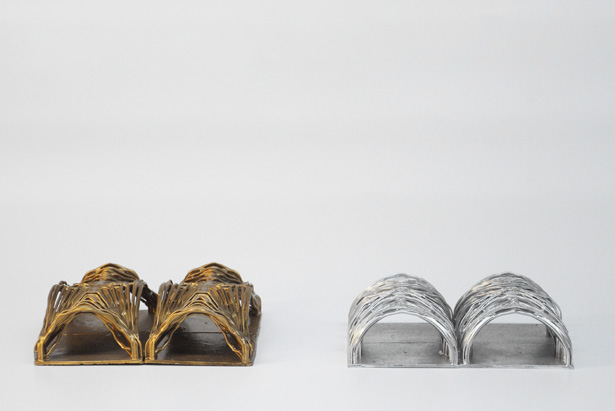
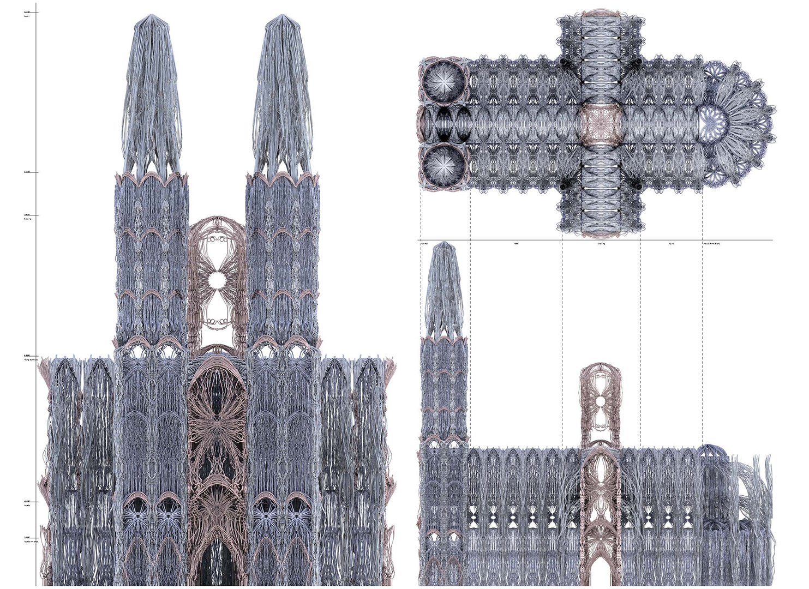
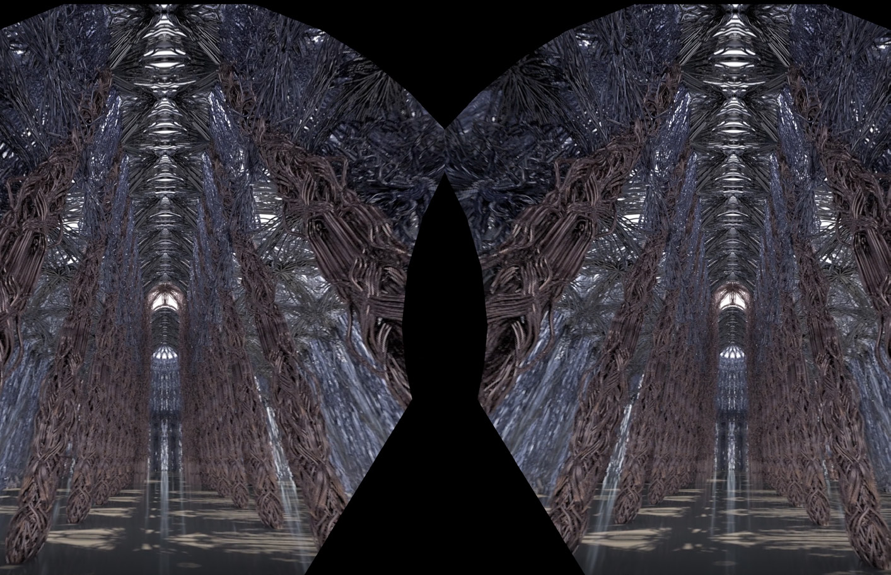
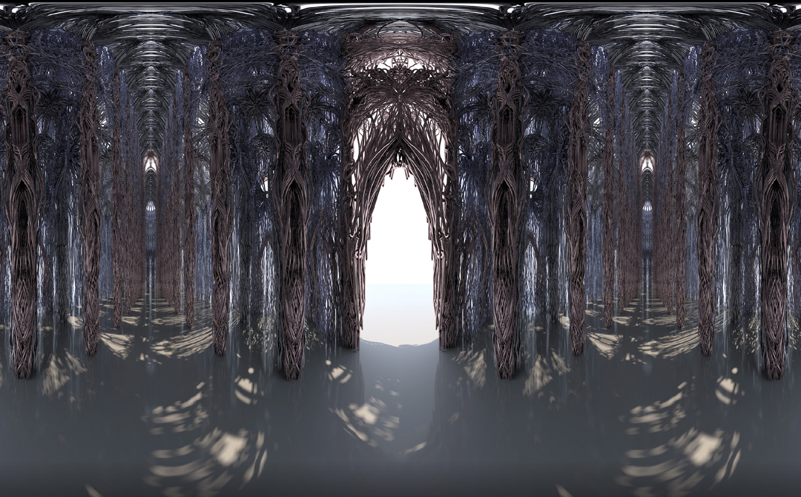
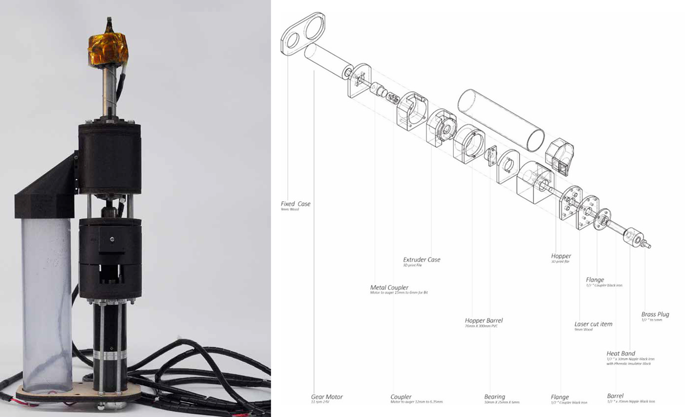
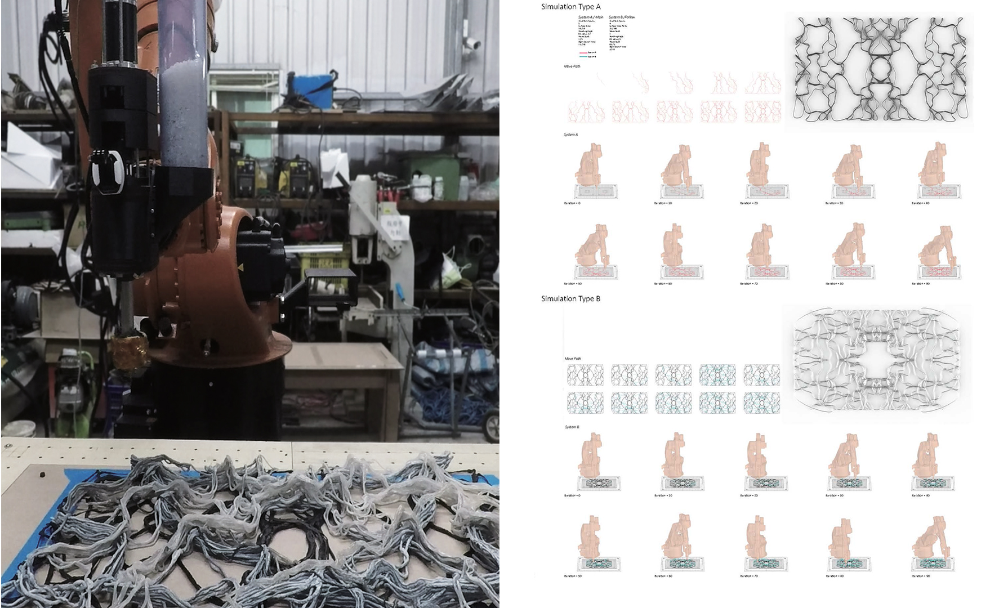

---

title: ' Autonomous Tectonic in Morphogenesis Structure '
description: " "
date: 2019-09-18T02:56:14+02:00
draft: fasle
tags: ["robotics", 3d printing", "comupter graphics"]

---


A study on glass inlays for Robotic 3D Concrete Printing and Placing


## Abstract
This is a research project based thesis in morphogenesis structure implemented with non-planar robotic 3D printing. The process of matter is to gather independently or have an agent system, and it would create new methods with autonomous assemblies and collective construction through new machines and materials. As a bottom-up development, this process attempts to practice extensibility, adaptability, repeatability and any number of aggregations.

<iframe src="https://drive.google.com/file/d/1UcaUxFFs8yEvpX0f1YFZnk7-Dqri0m_Z/preview" width="540" height="320" allow="autoplay"></iframe>

## Morphogenesis Structure Study
For the structure studies, it uses morphogenesis algorithms which means the particle units morphy by complex systems and generative algorithms, and this process which with discrete individuals grow and contributing to one or more continuous geometry. The steps of method contains three different categories: “Morphing of points, Curve”; “Morphing of curves, Surface”; and “Morphing of surfaces, Space”.

  
  
  

## Reinterpreted historic Gothic church
In this stage, the goal is to use modern tools to re-interpret the historic Gothic church through movement of particles to explore the possibility of generative novel architectural space by comparing the traditional and contemporary media of design method.
The collection of multi-scale spatial elements blurs the boundary between form, structure and decoration, reinterpreting the meaning of Gothic church space; this meaning is the expression of force in structure and emphasized in the Gothic church. Also, the generation process of computational dynamic simulation implies the principle of the Gothic church structure.

>#### Virtual reality
>This space of the Gothic church based on a computer simulation is combined with the virtual reality system, called VIVE developed by HTC, creating the simulated space experience through the head-mounted display.

## Robotic 3D Printing fabrication

The simulated Gothic space is complex and cannot be easily constructed by hand, some of the simulated building elements were actually constructed in the real space by the Robotic 3D Printing with nonplanar method. In this phase, it also focous on end-effector tooling in 3D printing extruder and how to implement this structure system in nonplanar method.

### Printing End-effector

### Robotic Path algorithm

## Application

---

#### Publications
* [Golden Pin Concept Design Award](https://www.goldenpin.org.tw/en/project/autonomous-tectonic-meta-matter/)
* [IsArch Architecture thesis Award](https://isarch.org/?edition=9)
