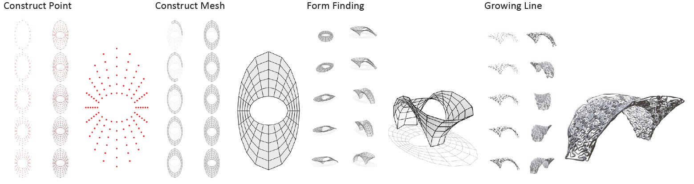
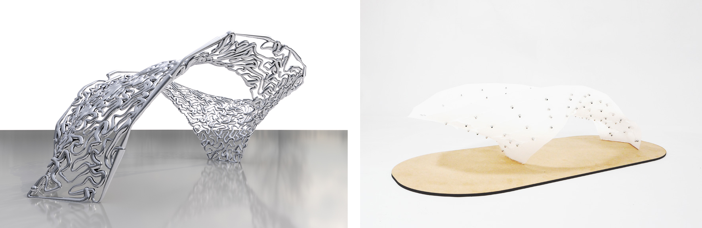
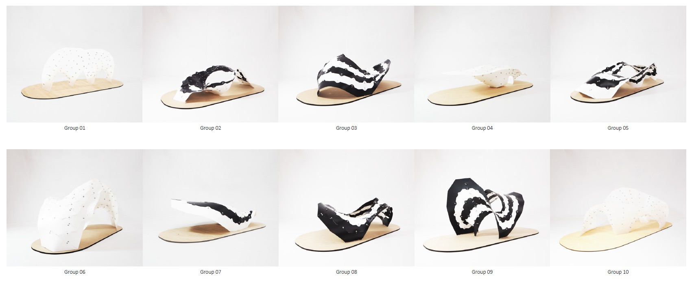

---

title: 'Form Finding Gerometry Workshop'
description: " "
date: 2018-08-20T02:56:14+02:00
draft: fasle
tags: ["workshop", "computer Graphics", "digital fabrication", "3D modeling"]

---


Parametric design to digital fabrication


## Description
Nowadays, we use several different 3D modeling software in architectural design process. At our five-day workshop, we mainly focus on establishing a digital design workflow and integrating different software. 

The workshop consists of four parts: 1.basic geometry construction; 2.form-finding through physical simulation; 3.utilizing oscillating tangential cutting machine to produce physical model; 4.data visualization and rendering. The workshop anticipated to stimulate new model for digital design.

<iframe width="560" height="315" src="https://www.youtube.com/embed/_X7HurvGMlg?si=KvRVuccZDbKrOKMt" title="YouTube video player" frameborder="0" allow="accelerometer; autoplay; clipboard-write; encrypted-media; gyroscope; picture-in-picture; web-share" referrerpolicy="strict-origin-when-cross-origin" allowfullscreen></iframe>

## Methodology
The design process includes four step: construct primitive points, mesh structure, physical stimulate engine to generate the geometry and design the form-finding process, and generate the pattern based on reaction diffusion algorithms.

## Participants Works

---
#### Publications
* [Digital AIEOU](https://papers.cumincad.org/cgi-bin/works/paper/caadria2023_365)
