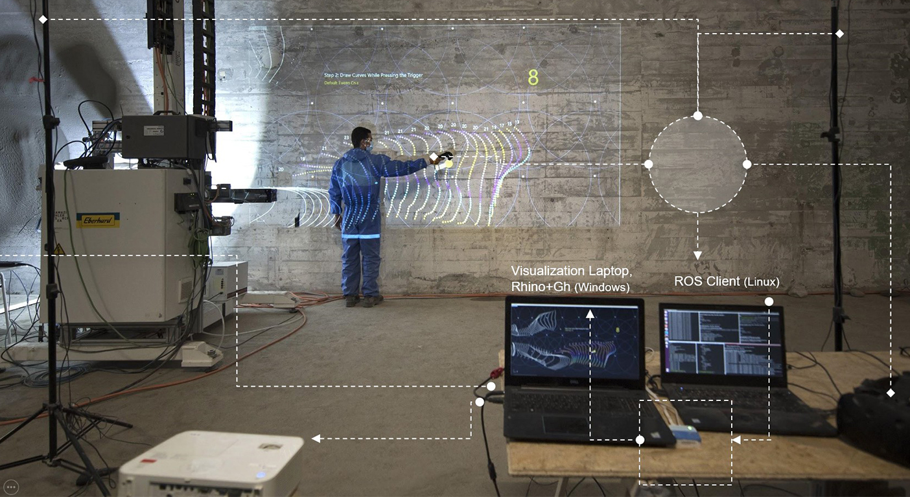
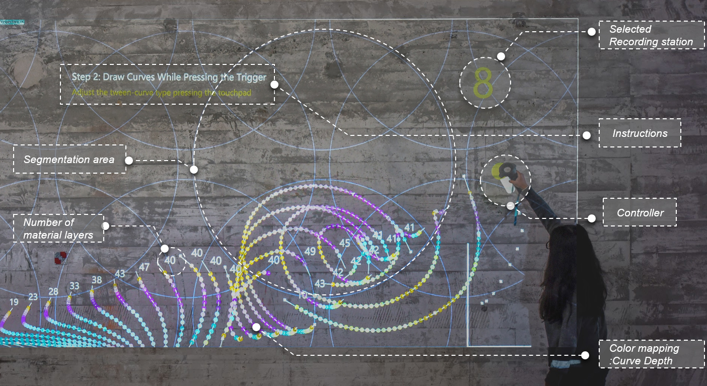
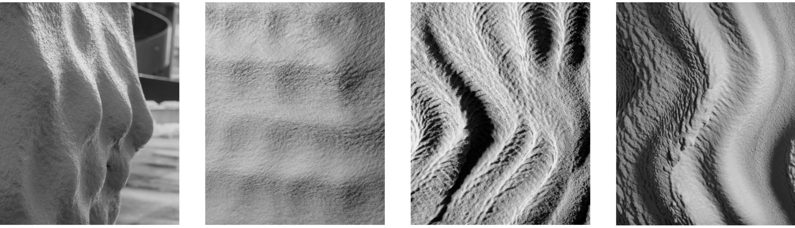
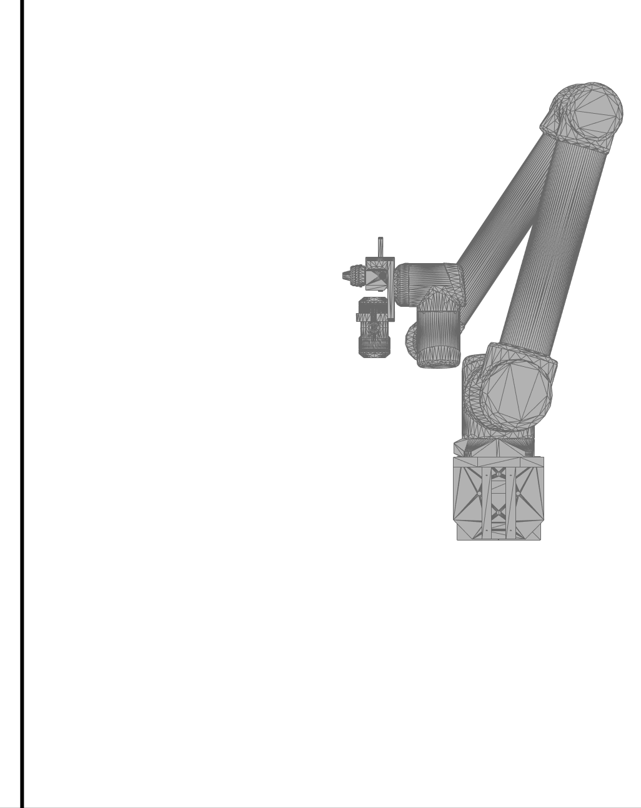
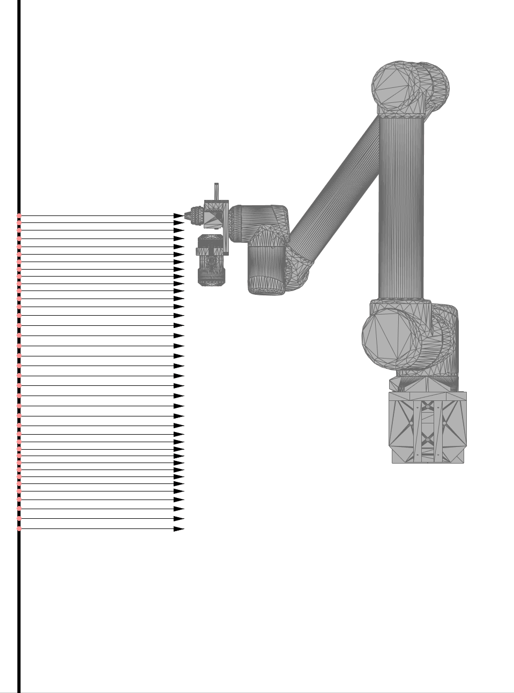
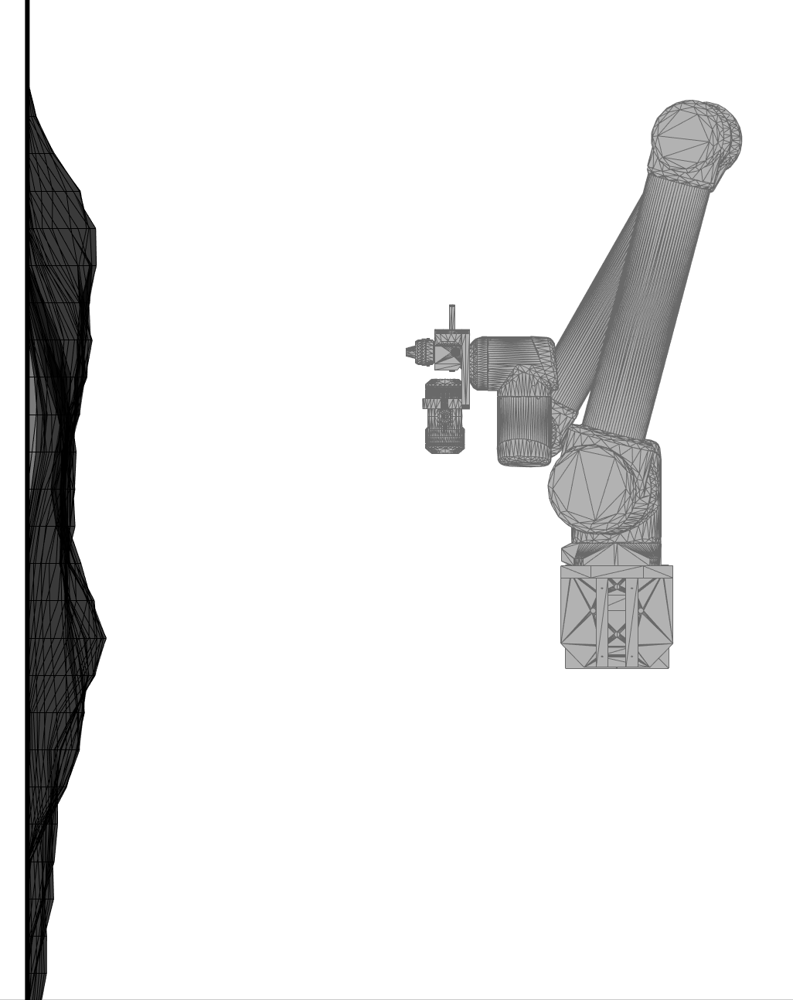
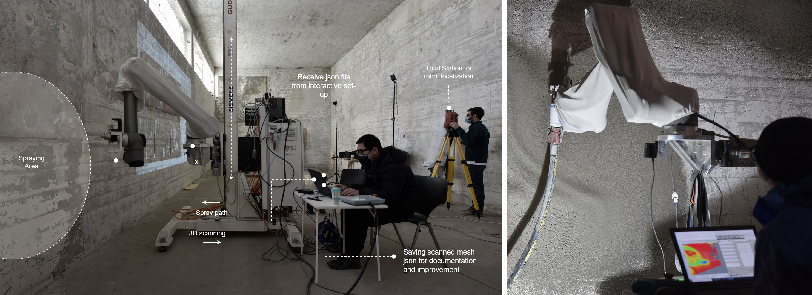
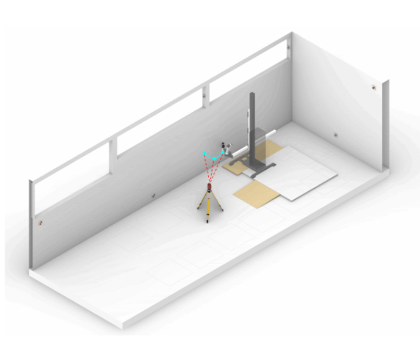
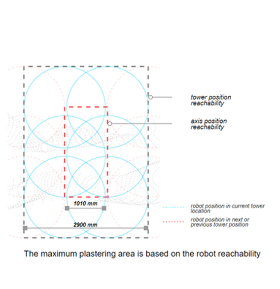

# Intutive Robotic Plastering
---

Human-machine collaboration for robotic on-site fabrication

---

## Introduction

This is a 11-week project of the MAS ETH in Architecture and Digital Fabrication explores the potential of novel digital fabrication processes to implement a full-scale construction project at Rümlang, Zürich. The topic combines Gramazio Kohler Research projects, Robotic Plaster Spraying and Human-Machine Collaboration, to propose new design and fabrication methodologies under the name of Intuitive Robotic Plastering.

On one hand the concept of Human-Machine Collaboration(Intuitive Design) is to think how human gestures are used as a design tool expressing very singular and sensible design process. On the other hand, Robotic Plaster Spraying allows to think through a different paradigm where and how plaster is applied by iteration of fine and subtle layers on the wall.

<iframe width="650" height="300" src="https://videopress.com/v/BV8YGQzu" frameborder="0" allowfullscreen></iframe>

## Intuitive Design
The intuitive design workflow begins with the input of the human gesture and the users could have an immediate visual feedback on their work which allows they to adjust the input accordingly. The gesture is tracked by HTC Vive system and the recorded data gets adjusted to the fabrication parameters by the interactive system developed in Rhino and Grasshopper as a plateform.

  
  

## Prototyping and Robotic Spraying methods
Before moving to the site, a series of prototyping is conducted by spraying plaster on the 1.2m x 2m panels, which largely helps us understand the influence of parameters like velocity, angle and distance of spraying (distance between wall and robot TCP) on the material behavior.
Three basic parameters are to develop the robotic spraying strategy.The end-effector distance and the velocity of spraying are mapped taking into account the recorded human gesture. Remapping these values according to the limitations of the robot and using feedback from the prototypes we initially did.
  <!-- 
Initial scan
 -->
  <!-- 
Initial spraying
 -->
  <!-- 
Updating scanned mesh
 -->
  <!-- 
Ed values updated
 -->

  

>Spraying steps: initial scan, initial spraying, updating scanned mesh, Ed values updated

  
  
  
  

<!-- On-site fabrication -->
<!-- <video width="1920" height="1080" controls> -->
<!--   <source src="./Temp_video_method.mp4" type="video/mp4"> -->
<!-- </video> -->

## On-site Construction and Segmentation
Global localization and local segmentation are two important parts of on-site fabrication. For the global localization it requires 11 tower positions to finish the overall design and the local segmenting , base on the robot reachability and the design, it requires 2 to 4 axis positions to cover the design of current tower location.
The final result is the design and construction of an interior space within an existing structure at Rümlang. The room offers us approximate 200m² to apply an adaptive thin layer printing process with an interactive design procedure – where a robotic arm sprays plaster following recorded hand gestures, creating an interplay between human instructed and digitally controlled fabrication processes with new aesthetic of conventional material.

> Total station localization
 

  
  

## Application

---
# Publications
* [GKR](https://gramaziokohler.arch.ethz.ch/web/d/projekte/461.html)

