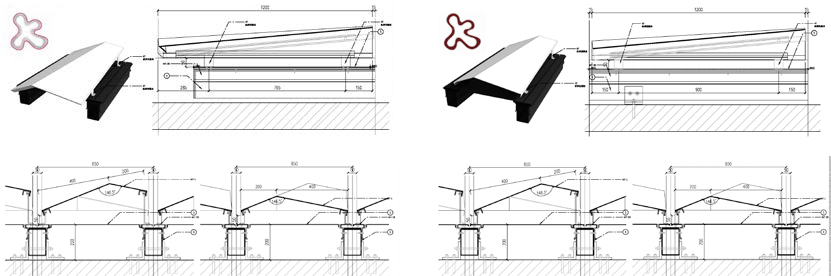

---

title: 'Eral Exhibiation Center'
description: " "
date: 2019-06-20T02:56:14+02:00
draft: fasle
tags: ["computer Graphics", "architecture engineering", "3D modeling"]

---


Geometrical analysis & optimization and architectural design


## Description
This project serves as consultant to help architect firm with geometrical analysis and optimization. and finish the shop drawing to construction. Digitally construct algorithmic models which combines digitized real information from site and includes all the façade parts and components with parameters of quantities, material properties, fabrication and installation requirements.

## Geometrical Analysis and Optimization
In the project, we delivery a software plugin for the CAD software for the client. From design to fabrication principles, it uses geometrical analysis, and optimizations, which are performed through data collection computational algorithmic tools. Rationalized design according to materials, construction methods and budget, under the requirement of design principles.

## Detail Shop Drawings

This step consists of four tasks, including develope architectural, constructional details with Designer, contractor to ensure the aesthetics based on performances, and construct abilities of the building envelope.

## Architectural Visualization

---
